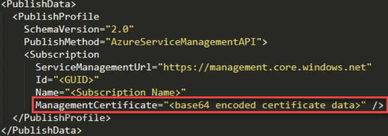

## steal access tokens

### GCP

Google JSON TOkens and credentials.db are saved to disk. 

JSON tokens are typically used for service account access to GCP. They can be used to authenticate with gcloud and/or ScouteSuite.

if a user authenticates with gcloud from a compute instance their creds are stored here: ~/.config/gcloud/credentials.db

`sudo find /home -name "credentials.db"`

### Azure

#### Azure Cloud Service Packages (.cspkg)

cspkg are deployment files created by Visual Studio. They offer possiablty to in intergrate to azure services such as SQL, Storage, etc.
These files use the zip file format. Look in these files for creds/certificates. They can be found in `<cloud project dir>\bin\debug\publish`

#### Azure Publish Settings files (.publishsettings)

Designed to make pushing code to azure easier. Search for these files in the Downloads folder or the VS projects folder.

They contain a Base64 encoded management certifiacte and sometimes clear test credentials.  Just open these files in a text editor and search them. To save the cert, save the cert copy the base64 encoded data and save it as a pfx file.

#### Extract keys from storage explorers

Developers often use storage explorers to easily upload and download files to Azure. It may be possiable to extract storange credentials from these tools. Storage Explorers store credentials on disk (Windows Credential Manager) and use them to authenticate to services such as Azure. There are a number of different storage explorers that change frequently.  

Azure Storage Explorer has a built-in "Developer Tool" that allows you to set breakpoints while loading credentials allowing you to view them unencrypted.

#### web.config and app.config files

WebApps often need read/write access to cloud storage or DBs. These credentials can be saved in a web.config or app.config file.
Look for credentials or management certs (which can be saved to a PFX file). These files can often be found at the root folder of a WebApp.

#### Azure tools

When authenticating to Azure with something like the Az PowerShell module a file named TokenCache.dat is saved in `%USERPROFILE%\.azure\`. This file can be combined with the 'AzureRmContext.json' file, creating the equivalent of the output from the Save-AzContext command. Use [AzStealContext](https://github.com/justin-p/AzStealContext) to abuse this.

### Command history

May contain creds or tokens or other commands indicating where to look.

`~/.bash_history`
`%USERPROFILE%\AppData\Roaming\Microsoft\Windows\PowerShell\PSReadLine\ConsoleHost_history.txt`

### Internal Code Repositores

G O L D  M I N E for keys.

Find internal repos

- portscanning webservices and then using something like EyeWitmess to screenshot each result.
- Query AD for all hostnames, look for subdomains such as git, code, repo, bitbucket, gitlab, etc.

If you find these (and have access to repos) you can use automated tools (gitleak, trufflehog, gitrob) or use the built-in search features.

Search for string such as:

- AccessKey
- AKIA
- id_rsa
- credentials
- secret
- password
- token
